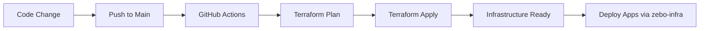

# Zebo Terraform - Infrastructure as Code

Centralized IaaC repository for provisioning GCP resources for the Zebo platform.

## 📁 Repository Structure

```
zebo-terraform/
├── environments/          # Environment-specific configurations
│   ├── dev/              # Development environment
│   │   ├── main.tf       # Main configuration
│   │   ├── variables.tf  # Variable definitions
│   │   ├── outputs.tf    # Output definitions
│   │   ├── provider.tf   # Provider configuration
│   │   └── dev.tfvars    # Development values
│   └── prod/             # Production environment (future)
├── modules/              # Reusable Terraform modules
│   ├── gke/             # GKE cluster module
│   ├── artifact_registry/ # Container registry
│   ├── secret_manager/   # Secret management
│   └── project/          # GCP project APIs
└── .github/workflows/    # CI/CD pipelines
    ├── terraform-dev.yaml
    └── terraform-destroy-dev.yaml
```

## 🚀 Quick Start

### Prerequisites

- GCP account with project `zebraan-gcp-zebo-dev`
- `gcloud` CLI installed and authenticated
- Terraform >= 1.9.5

### Local Development

```bash
# Navigate to environment
cd environments/dev

# Initialize Terraform
terraform init

# Plan changes
terraform plan -var-file=dev.tfvars

# Apply changes
terraform apply -var-file=dev.tfvars
```

## 🔧 Infrastructure Components

### Core Resources

- **GKE Cluster** - Kubernetes cluster for application workloads
- **Artifact Registry** - Docker image storage
- **Secret Manager** - Secure secret storage
- **Service Accounts** - IAM for GKE nodes and Terraform

### Features

✅ **Spot Instances** - Cost-optimized GKE nodes  
✅ **Autoscaling** - Dynamic node pool scaling  
✅ **Workload Identity** - Secure GCP API access  
✅ **Network Policies** - Enhanced security with Calico  
✅ **VPC-Native Networking** - Alias IP ranges  

## 🎯 GitHub Actions

### Terraform Deployment

Automatically runs on:
- Push to `main` branch (changes to `environments/`, `modules/`, or workflows)
- Manual trigger via `workflow_dispatch`

**Variables required:**
- `GCP_REGION` - GCP region (default: asia-south1)
- `ARTIFACT_REGISTRY_ID` - Registry ID (default: zebo-registry)
- `NODE_MACHINE_TYPE` - VM type (default: e2-medium)
- `MIN_NODES` - Minimum nodes (default: 1)
- `MAX_NODES` - Maximum nodes (default: 5)
- `USE_SPOT_INSTANCES` - Enable spot VMs (default: true)
- `GKE_DELETION_PROTECTION` - Cluster protection (default: true)
- `TERRAFORM_SERVICE_ACCOUNT_EMAIL` - Terraform SA email

**Secrets required:**
- `GCP_CREDENTIALS` - Service account JSON key
- `GCP_PROJECT_ID` - GCP project ID
- `ZEO_DB_PASSWORD` - Database password
- `ZEO_OPENAI_KEY` - OpenAI API key
- `ZEO_MF_UTIL_KEY` - MF utility key

### Terraform Destroy

Manual workflow for destroying infrastructure:
1. Go to Actions → Terraform Destroy Dev
2. Click "Run workflow"
3. Type `destroy` to confirm
4. Click "Run workflow"

## 📝 Configuration

### Adding a New Environment

```bash
# Create new environment directory
mkdir -p environments/staging

# Copy base configuration
cp environments/dev/*.tf environments/staging/

# Update variables
vim environments/staging/staging.tfvars
```

### Modifying Resources

1. Edit module files in `modules/`
2. Update environment config in `environments/<env>/`
3. Run `terraform plan` to preview changes
4. Commit and push to trigger CI/CD

## 🔐 Security Best Practices

- ✅ Never commit `.tfvars` files with real secrets
- ✅ Use GitHub Secrets for sensitive data
- ✅ Service accounts follow principle of least privilege
- ✅ Workload Identity enabled for secure pod authentication
- ✅ Network policies enforced via Calico
- ✅ Private GKE nodes (configurable)

## 💰 Cost Optimization

Current dev configuration:
- **Spot Instances**: ~70% cost reduction
- **Autoscaling**: Min 1, Max 5 nodes
- **e2-medium instances**: Cost-effective for dev
- **Estimated cost**: ~$20-50/month when active

## 🧪 Testing

### Validate Configuration

```bash
cd environments/dev
terraform fmt -check
terraform validate
terraform plan -var-file=dev.tfvars
```

### Pre-commit Hooks (Optional)

```bash
# Install pre-commit
pip install pre-commit

# Setup hooks
pre-commit install

# Run manually
pre-commit run --all-files
```

## 📊 Outputs

After applying, Terraform outputs:
- `gke_cluster_name` - Name of the GKE cluster
- `gcloud_get_credentials` - Command to configure kubectl

## 🔄 Workflow



## 🆘 Troubleshooting

### Service Account Permission Error

If you see: `Error 400: The user does not have access to service account`

**Solution**: Set `TERRAFORM_SERVICE_ACCOUNT_EMAIL` in GitHub Variables:
```bash
# Find your Terraform SA
gcloud iam service-accounts list --project=zebraan-gcp-zebo-dev

# Add to GitHub Variables
# Settings → Secrets and variables → Actions → Variables
# Name: TERRAFORM_SERVICE_ACCOUNT_EMAIL
# Value: terraform@zebraan-gcp-zebo-dev.iam.gserviceaccount.com
```

### State Lock Error

If Terraform state is locked:
```bash
# List locks
terraform force-unlock <LOCK_ID>

# Or check GCS bucket for stuck locks
```

### Plan Shows Unexpected Changes

```bash
# Refresh state
terraform refresh -var-file=dev.tfvars

# Check drift
terraform plan -detailed-exitcode -var-file=dev.tfvars
```

## 🔗 Related Repositories

- **zebo-infra** - Kubernetes manifests and Helm charts
- **zebo** - Application code

## 📚 Documentation

- [GKE Best Practices](https://cloud.google.com/kubernetes-engine/docs/best-practices)
- [Terraform GCP Provider](https://registry.terraform.io/providers/hashicorp/google/latest/docs)
- [Workload Identity Setup](https://cloud.google.com/kubernetes-engine/docs/how-to/workload-identity)

## 🤝 Contributing

1. Create a feature branch
2. Make changes
3. Test locally: `terraform plan`
4. Submit PR with description
5. Wait for CI checks to pass
6. Merge after approval

## 📄 License

See [LICENSE](LICENSE) file for details.
